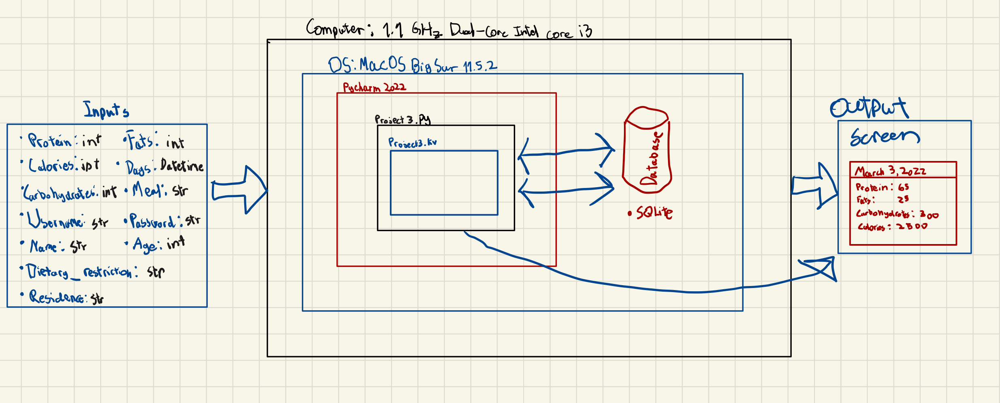
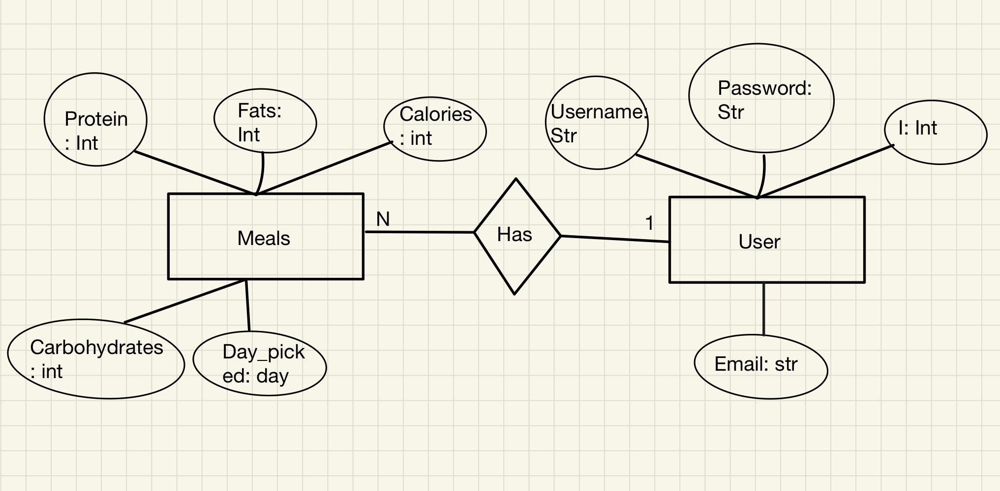
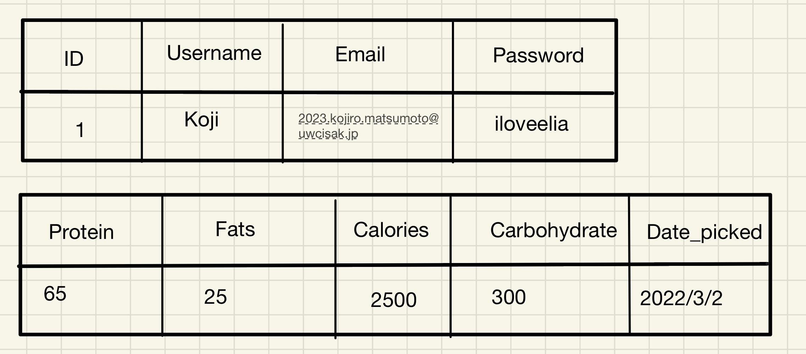

# Unit 3 Project: PFC (Protein, Fat, and Calories) Application Documentation

## Criteria A: Planning

### Problem Definition:
 
The client for this project is Kojiro Matsumoto. He is interested in keeping account of his nutrients intake per meal. Specifically, the intake of protein, fat, carbohydrates, and calories. Due to this, he would like an application that would allow him to keep track of his protein, fat, and calories intake per day.

### Success Criteria:

1. The application should have a log in system.
2. The application should have a sign up system.
3. The passwords of users should be encoded in a secure manner.
4. After the user logs in, the user should be able to pick whether they want to log their PFC intake (protein, fat, carbohydrates and calories) or monitor their PFC intakes.
5. To monitor PFC intakes, a calendar will be displayed. When users click on a date, the PFC intakes will be displayed.
6. The application should include cartoon drawings of food for asthetic purposes.

### Design Statement

I will design and make an application for a client who is interested in keeping track of his protein, fat, carbohydrates and calories intakes per day. The application will allow the client to log in, log their PFC (protein, fat, carbohydrates, and calories) intakes, and monitor their PFC intakes per day. Additionally, the log in system will ensure passwords to be encoded and secure. The application will be constructed using Pycharm, the Python language, and the KivyMD Language. This project will take 4 weeks and will be evaluated according to the criteria set above.

### Rationale for Proposed Solution

For the application, we will be using the Python language, as according to CodingNomads, is the most used language used coding language in the world and the langauge I am most comfortable with. If I were to use another language, I would have to learn the new language, slowing the process of creating the application. Additionally, Python ios compatible with the library that is being used (KivyMD). Therefore, using Python is most appropriate for this project compared to alternatives such as JavaScript or C. The library I will be using is KivyMD. KivyMD is a library that can be used with Python. According to Analytics Vidhya, KivyMD is extremely easy to use. Therefore, learning the functions of it will not take long. Furthermore, it facilitates cross-platform applications that can run on Windows, Linux, Android, OSX, IOS, and Rasberry Pi as well. Due to its versatilities, I will be using KivyMD instead of alternatives such as Libavg or PyQT. The database I will be using is SQLite. According to SQLitetutorial, SQLite allows  a single database connection to access multiple database files simultaneously. Furthermore, is capable of creating in-memory databases that are fast to work with (SQLite tutorial). Due to this, I have chosen KivyMD rather than alternatives such as Oracle Database, MariaDB, or IMB db2.

### Details

When first opening the application, a log in or sign up option will be displayed. There will be cartoon drawings of nutritious foods as decorations. Once signed up, an option to log the PFC intakes or monitor the PFC will be displayed. If you were to log the PFC intakes, there will be three white boxes where you input the protein, fat, carbohydrates, and calories intakes. If you were to monitor the PFC intakes, a calendar with dates will appear. Once clicking on a date, the PFC intakes of that particular date will be displayed. 

### Citations

1. Wali, K., Ramnani, M., Krishna, S., &amp; Chatterjee, P. (2021, May 29). 8 python GUI frameworks for developers. Analytics India Magazine. Retrieved February 24, 2022,
2. What is KivyMD: Creating android machine learning apps using KivyMD. Analytics Vidhya. (2021, July 6). Retrieved February 24, 2022,
3. What is sqlite? top sqlite features you should know. SQLite Tutorial. (2020, July 8). Retrieved March 9, 2022
4. Why learn python? 6 reasons why it's so hot right now. CodingNomads. (2022, January 19). Retrieved February 24, 2022, 

## Criteria B: Solution Overview

### System Diagram

Figure 1. The System Diagram For the Application

As shown in Fig.1, the proposed solution runs on Python and a KivyMD library. Furthermore, it is developed using Pycharm. The proposed application has 12 inputs which vary from personal information, login information, and daily nutrients information. The application will use SQLite as the database. The output will be a calender screen. If the user clicks on a date, the nurtients information of the date will be displayed.

### Wireframe

Change the wireframe

Figure 2. The Wire Frame For the Application

As shown in Fig.2, the wire frame details the plan as to how the application will look. The app will open with a log in page. If the register button is clicked, the user will be able to register by inputing their chosen username, email, and password. Once the register button is clicked, it will redirect the user to the home page. Next, the user can pick to input their nutrients intake, monitor their daily intake, or log out. Once the input button is clicked, the user logs the date, protein, fats, carbohydrates, and calories intakes. Once the user clicks the log button, they are redirected to the home page. If the table screen is selected where users can see all the logged nutrients informations. Users also have the option to calculate the total and average calories. Then, users can click the back button where they are directed to the homepage.

### ER Diagram

Figure 3. ER Diagram For the Attributes Requested By the Client

As shown in figure 3, in the "nutrients" table, the attributes are "protein", "fats", "calories", "carbohydrates", "day_picked". This table details all the nutrients that the client would like to log into the application. The second class which is "User" has the attributes "id", "username", "email", "password". This class details the email and information as well as log in information of the users.

### Table of Data

Figure 4. A Table Representing the Data In the ER Diagram

As shown in figure 4, the two tables represent the two classes and the attributes in the classes shown in the ER diagram. Furthermore, the data in the second row of each table showcase all the inputs of each attribute, such as the personal information, the log in information, and the nutrients infomration of logged in March 2 of the client. 

### UML Diagram

Figure 5. The UML Diagram For the Classes In the Application

As shown in figure 5. the UML diagram shows the attribuites and the methods for the two classes. There are only "get" methods as the application's function is only to store data display it at the request of the users.

### Flow Diagrams

Figure 6. The flow diagram for when users try loggin in. If the password is correct, they are directed to the home page. On the other hand, if the password is incorrect, it prints out "User does not exist".

Figure 7. The flow diagram is for calculating the average and total calories according to the database. There is a button on the screen titled "calculate calories". When pressed, the total and average calories poop up.

Figure 8. The flow diagram is for the query functions. "query_user" is for verifying if the password entered in the login screen is correct to their email. Meanwhile, "query_files" is for fetching all the data from the "nutrient" table and will be put in the Table Screen.

### Test Plan

| Description                                                                                                                                                                           | Type                            | Testing steps                                                                                                                                                                                                                                              | Output                                                                                                                                                                                                                                                                                                                                                                                                                                                              |
|---------------------------------------------------------------------------------------------------------------------------------------------------------------------------------------|---------------------------------|------------------------------------------------------------------------------------------------------------------------------------------------------------------------------------------------------------------------------------------------------------|---------------------------------------------------------------------------------------------------------------------------------------------------------------------------------------------------------------------------------------------------------------------------------------------------------------------------------------------------------------------------------------------------------------------------------------------------------------------|
| Testing if the login works                                                                                                                                                            | Functional: Integration testing | 1.Open the application 2.Input the registered email 3.Input the registered password 4.Click the "login" button 5.End the program                                                                                                                           | The screen should change to a screen titled "Home Page" without bugs.                                                                                                                                                                                                                                                                                                                                                                                               |
| Testing if the registry works                                                                                                                                                         | Functional: Integration testing | 1.Open the application 2.Click on the button titled "Register" 3.Input username 4.Input email 5.Input password 6.End the program                                                                                                                           | The screen should change from the login screen to a screen titled "Register Screen"  when the register button is clicked. After inputting all necessary informations, the  screen should change to a screen titled "Home Page" after the register button is clicked.  After closing and re-openning the application, the user should be able to log in with the registered information.                                                                             |
| Testing if inputting nutrients information works                                                                                                                                      | Functional: Integration testing | 1.Open the application 2.Log in 3.Click on the "Input" button in the home page 4.Input information about nutrients and date 5.Click the "Input" button 6.Click on the "Table" button 7.Check if the inputted information is on the table 8.End the program | The screen should change from the home page screen to a screen titled "Home Page". After inputting nutrients informations, the screen should change to the home page screen after the input button is clicked. To check if the inputted information is logged in the  database, click on the button on the home page called table. After doing so, the screen should be changed to a screen titled "Table Screen". The inputted information should be on the table. |
| Testing if the table screen works                                                                                                                                                     | Functional: Integration testing | 1.Open the application 2.Log in 3.Click on the "Table" button 4.Click on the "Calculate calories" button 5.End the program                                                                                                                                 | The table in the table screen should have six columns. The first being a box that the user can check. Then, protein, fats, carbs, calories, and then date_picked. Additionally, when the "calculate calories" button is clicked, the texts that were written as "Total calories" and "Average Calories" should change to the total and average calories of all informatioin on the table.                                                                           |
| Reviewing if the code has adequate comments, function name,  and variable name.                                                                                                       | Non-functional: Code review     | As this reviews the quality of the code, there are no inputs.                                                                                                                                                                                              | The code will contain comments to explain what is going on in the code. Furthermore, names  of variables are simple.                                                                                                                                                                                                                                                                                                                                                |
| Testing if the table in the table screen shows the appropriate  nutrients informations without glitches or bugs. Additionally, all newly inputted informations should pop up as well. | Non-functional: Load testing    | 1. Open the application 2. Log in 3. Click on the "Table" button                                                                                                                                                                                           | All informations on the table should be appropriate to which column it falls under. Furthermore, if nutrients information is newly added, it should appear on the table.                                                                                                                                                                                                                                                                                            |

### Record of Tasks

| Task No. | Planned Action                                           | Time Estimate | Target Completion Date | Criteria |
|----------|----------------------------------------------------------|---------------|------------------------|----------|
| 1        | Brainstorm and write the problem definition              | 15 mins       | February 28            | A        |
| 2        | Brainstorm and write the success criteria                | 15 mins       | February 28            | A        |
| 3        | Brainstorm and write the design statement                | 20 mins       | March 2                | A        |
| 4        | Brainstorm and write the rationale for proposed solution | 30 mins       | March 2                | A        |
| 5        | Write citations                                          | 15 mins       | March 2                | A        |
| 6        | Write the details of the application                     | 20 mins       | March 2                | A        |
| 7        | Draw and describe the ER diagram                         | 20 mins       | March 4                | B        |
| 8        | Draw and describe the table of data                      | 15 mins       | March 4                | B        |
| 9        | Draw and describe the UML diagram                        | 15 mins       | March 4                | B        |
| 10       | Code the log in screen                                   | 1 hour        | March 7                | C        |
| 11       | Code the register screen                                 | 1 hour        | March 9                | C        |
| 12       | Code switches between screens                            | 30 mins       | March 10               | C        |
| 13       | Code inserting inputs of the user to the databse         | 50 mins       | March 10               | C        |
| 14       | Code the encryption of passwords using hash              | 40 mins       | March 28               | C        |
| 15       | Fix up the register screen                               | 15 mins       | March 30               | C        |
| 16       | Fix up the hash password encryption                      | 15 mins       | March 30               | C        |
