# Unit 3 Project: PFC (Protein, Fat, and Calories) Application Documentation


## Criteria A: Planning

### Problem Definition:
 
The client for this project is a student at UWC ISAK Japan. He has a hobby of exercising and eating. To ensure that he is eating healthy, he is interested in keeping account of his personal nutrients intake per meal. Specifically, the intake of protein, fat, carbohydrates, and calories. Due to this, he would like an application that would allow him to keep track of his protein, fat, and calories intake per day. Additionally, he would like to monitor his nutrients intakes. He would also like the application to have a GUI and has accessible butttons and text boxes to make the application easy to use. He needs an application to do so instead of recording on paper as he would like to continuously track his nutrients daily for a long period of time. Thus, continuously buying paper would be harmful to the environment as well as storing such papers would be difficult. The client also will have to continuously buy paper. By using an application that connects to a database, the client does not have to store data manually as it automatically does so and will not have to spend extra money on buying paper. Additionally, it is less harmful to the environment.

### Success Criteria:

1. The application should have a log in system that checks if the email and password is correct with data validation.
2. The application should have a register system that registers the inputted username, email, and password.
3. After the user logs in, the user should be able to pick whether they want to log their nutrients intake or monitor their nutrients intakes.
4. The application should include cartoon drawings of food for aesthetic purposes.
5. When the "calculate calories" button is clicked, the average and total calories of the saved records should show up.
6. When inputting nutrients intakes, it should be saved and data should be persistent with the database.

### Design Statement

I will design and make an application for a client who is interested in keeping track of his protein, fat, carbohydrates and calories intakes per day. The application will allow the client to log in, log their PFC (protein, fat, carbohydrates, and calories) intakes, and monitor their PFC intakes per day. Additionally, the log in system will ensure passwords to be encoded and secure. The application will be constructed using Pycharm, the Python language, and the KivyMD Language. This project will take 4 weeks and will be evaluated according to the criteria set above.

### Rationale for Proposed Solution

For the application, I will be using the Python language, as I, the developer am the most comfortable with it and thus will be able to meet the client's demands in a quicker manner as opposed to other languages. Additionally, according to CodingNomads, python is the most used coding language in the world as it has 30% of computer language searches on Google [1]. Due to its popularity, the program can be easily understood by a larger number of developers in comparison to other languages, such as C or Javascript. This is beneficial to the client as it allows for future developers to easily undertand the code and further develop the program. Python offers a large variety of libraries with can be accessed with simple syntax [2]. This avoids the complexity in using external libraries that appears in languages such as C++. However, there are disadvantages to using Python. One of which is Python's inability to run on mobile applications [3]. However, this application will be run on the computer, therefore, it will not be a problem.

The library I will be using is KivyMD. KivyMD is a library that only works on Python. I am using an external library as it is a framework which creates a GUI (graphical user interface) for the developer which is essential in creating an application. Thus, the program does not run on the Python console but on the GUI screen. The language used for Kivy is simple and the logic is written in the Python program. According to Active State, KivyMD has "powerful graphics" which allows for asethetic designs. This is because KivyMD uses application designs of Android [4]. Thus, it will make the application look asethic and cohesive. Additionally, it facilitates cross-platform applications that can run on Windows, Linux, Android, OSX, IOS, and Rasberry Pi as well [5]. Thus, allowing for future developers to expand the application to other platforms. However, KivyMD has bugs with certain features [6]. As my program won't be using complex featurs, this will not be a significant problem. Due to its versatilities, simplicity for learning, and powerful graphics, I will be using KivyMD instead of alternatives such as Libavg or PyQT. 

The database I will be using is SQLite. Using a database is important in this project as the client wishes to store inputted data. Thus, a database is able to safely store large amounts of data reliably. SQLite is simple to use as it avoides lengthy procedural routines that various databases use, such as IMB db2 [7]. Thus, it will take a shorter time to create a program that meets the client's needs. Additionally, according to SQLitetutorial, SQLite allows a single database connection to access multiple database files simultaneously. Furthermore, is capable of creating in-memory databases that are fast to work with [8]. Another advantage of SQLite is the cross platform compatibility [9]. This is beneficial to the client as it allows for future developers to expand the program to other platforms. SQLite has a weakness of not having various multi-user capabilities that MySQL and PostgreSQL has. This is not a problem for this program as the client detailled that the purpose of the application is personal. Thus, not many multi-user functions need to be used [9].

The application will have an output of a GUI rather than text. This is because the client would like an application that can record his nutrient intakes and show the saved record. Thus, by using a GUI it easier to use for the client as it can show the saved records in an organized and visual manner. Due to this, the output should be through a GUI.

## Criteria B: Solution

### System Diagram

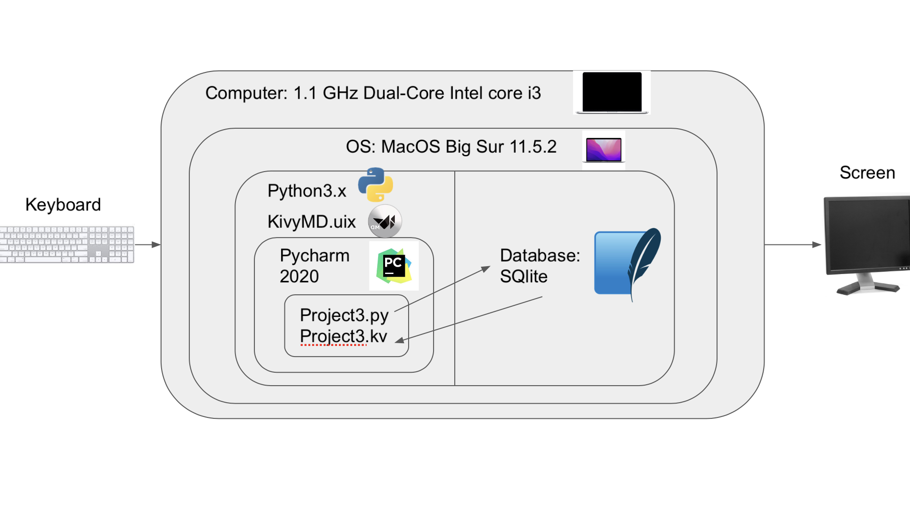

Figure 1. The System Diagram For the Application

As shown in Fig.1, the proposed solution runs on Python and a KivyMD library. Furthermore, it is developed using Pycharm. The proposed application has 12 inputs which vary from personal information, login information, and daily nutrients information. The application will use SQLite as the database. The output will be a calender screen. If the user clicks on a date, the nurtients information of the date will be displayed.

### Wireframe

Change the wireframe
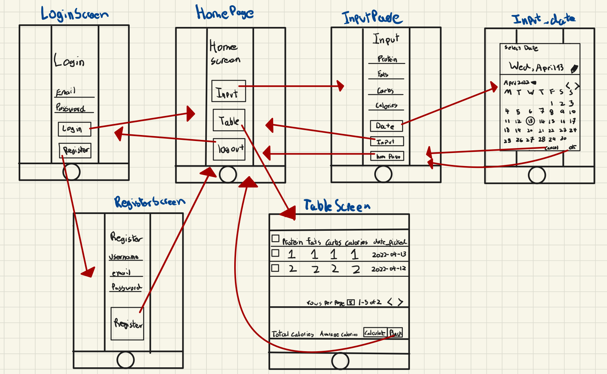

Figure 2. The Wire Frame For the Application

As shown in Fig.2, the wire frame details the plan as to how the application will look. The app will open with a log in page. If the register button is clicked, the user will be able to register by inputing their chosen username, email, and password. Once the register button is clicked, it will redirect the user to the home page. Next, the user can pick to input their nutrients intake, monitor their daily intake, or log out. Once the input button is clicked, the user logs the date, protein, fats, carbohydrates, and calories intakes. Once the user clicks the log button, they are redirected to the home page. If the table screen is selected where users can see all the logged nutrients informations. Users also have the option to calculate the total and average calories. Then, users can click the back button where they are directed to the homepage.

### ER Diagram

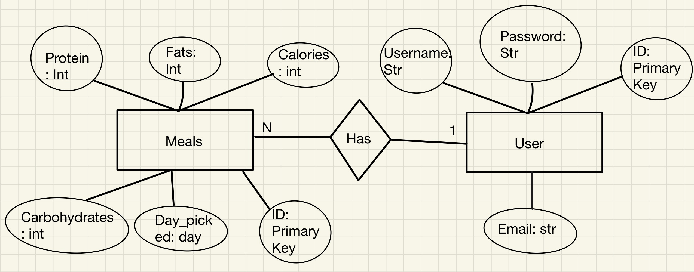

Figure 3. ER Diagram For the Attributes Requested By the Client

As shown in figure 3, in the "nutrients" table, the attributes are "protein", "fats", "calories", "carbohydrates", "day_picked". This table details all the nutrients that the client would like to log into the application. The second class which is "User" has the attributes "id", "username", "email", "password". This class details the email and information as well as log in information of the users. "Id" is the primary key and what makes the two tables related.

### Table of Data

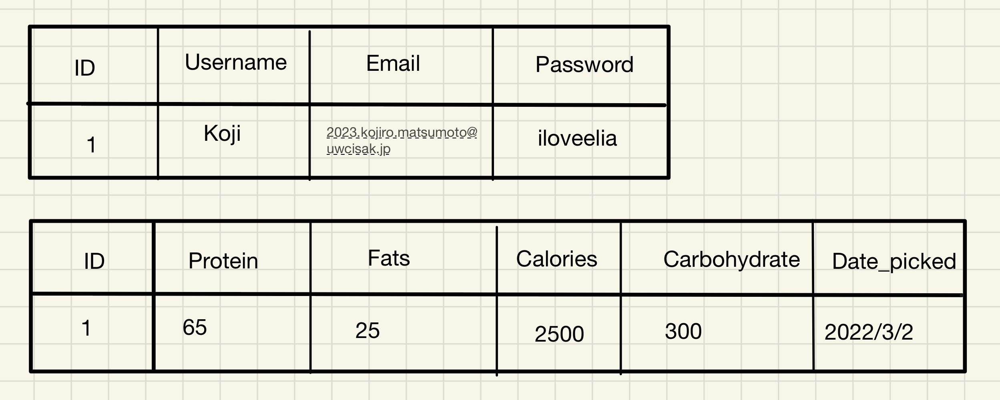

Figure 4. A Table Representing the Data In the ER Diagram

As shown in figure 4, the two tables represent the two classes and the attributes in the classes shown in the ER diagram. Furthermore, the data in the second row of each table showcase all the inputs of each attribute, such as the personal information, the log in information, and the nutrients infomration of logged in March 2 of the client. 

### UML Diagram

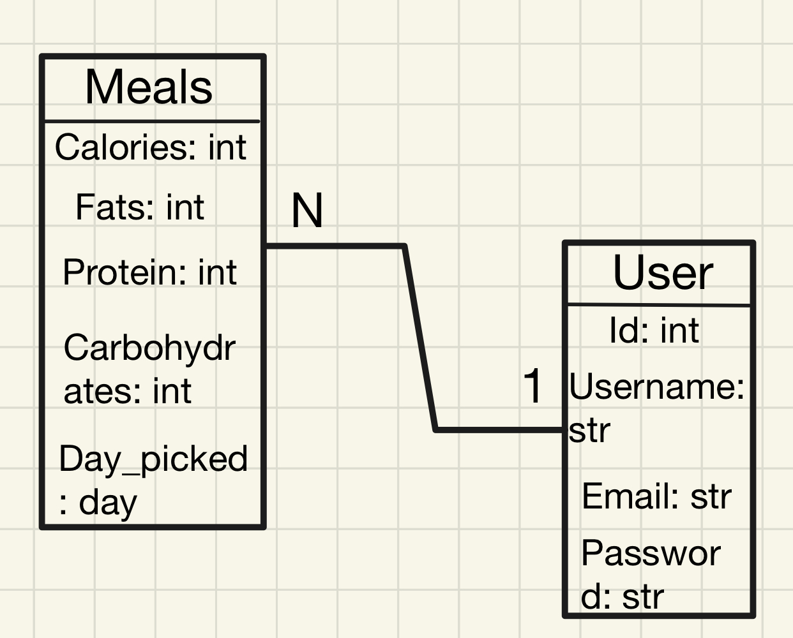

Figure 5. The UML Diagram For the Classes In the Application

As shown in figure 5. the UML diagram shows the attribuites and the methods for the two classes. There are only "get" methods as the application's function is only to store data display it at the request of the users.

### Flow Diagrams

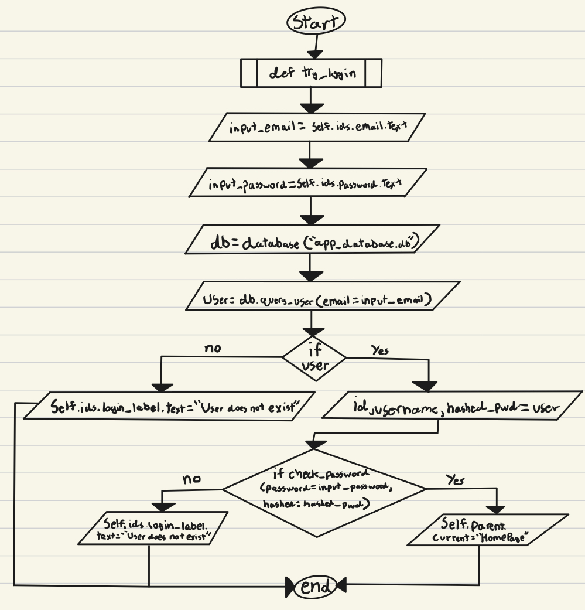

Figure 6. The flow diagram for when users try loggin in. If the password is correct, they are directed to the home page. On the other hand, if the password is incorrect, it prints out "User does not exist".

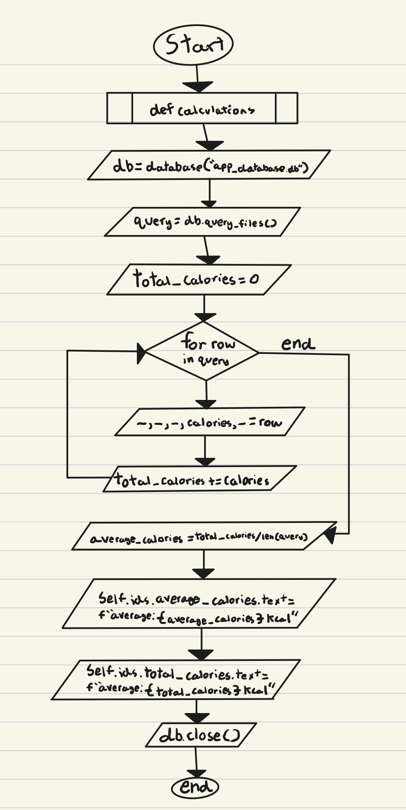

Figure 7. The flow diagram is for calculating the average and total calories according to the database. There is a button on the screen titled "calculate calories". When pressed, the total and average calories poop up.

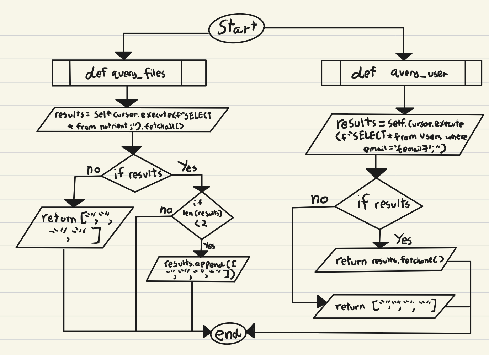

Figure 8. The flow diagram is for the query functions. "query_user" is for verifying if the password entered in the login screen is correct to their email. Meanwhile, "query_files" is for fetching all the data from the "nutrient" table and will be put in the Table Screen.

### Test Plan

| Description                                                                                                                                                                           | Type                            | Testing steps                                                                                                                                                                                                                                              | Output                                                                                                                                                                                                                                                                                                                                                                                                                                                              |
|---------------------------------------------------------------------------------------------------------------------------------------------------------------------------------------|---------------------------------|------------------------------------------------------------------------------------------------------------------------------------------------------------------------------------------------------------------------------------------------------------|---------------------------------------------------------------------------------------------------------------------------------------------------------------------------------------------------------------------------------------------------------------------------------------------------------------------------------------------------------------------------------------------------------------------------------------------------------------------|
| Testing if the login works                                                                                                                                                            | Functional: Integration testing | 1.Open the application 2.Input the registered email 3.Input the registered password 4.Click the "login" button 5.End the program                                                                                                                           | The screen should change to a screen titled "Home Page" without bugs.                                                                                                                                                                                                                                                                                                                                                                                               |
| Testing if the registry works                                                                                                                                                         | Functional: Integration testing | 1.Open the application 2.Click on the button titled "Register" 3.Input username 4.Input email 5.Input password 6.End the program                                                                                                                           | The screen should change from the login screen to a screen titled "Register Screen"  when the register button is clicked. After inputting all necessary informations, the  screen should change to a screen titled "Home Page" after the register button is clicked.  After closing and re-openning the application, the user should be able to log in with the registered information.                                                                             |
| Testing if inputting nutrients information works                                                                                                                                      | Functional: Integration testing | 1.Open the application 2.Log in 3.Click on the "Input" button in the home page 4.Input information about nutrients and date 5.Click the "Input" button 6.Click on the "Table" button 7.Check if the inputted information is on the table 8.End the program | The screen should change from the home page screen to a screen titled "Home Page". After inputting nutrients informations, the screen should change to the home page screen after the input button is clicked. To check if the inputted information is logged in the  database, click on the button on the home page called table. After doing so, the screen should be changed to a screen titled "Table Screen". The inputted information should be on the table. |
| Testing if the table screen works                                                                                                                                                     | Functional: Integration testing | 1.Open the application 2.Log in 3.Click on the "Table" button 4.Click on the "Calculate calories" button 5.End the program                                                                                                                                 | The table in the table screen should have six columns. The first being a box that the user can check. Then, protein, fats, carbs, calories, and then date_picked. Additionally, when the "calculate calories" button is clicked, the texts that were written as "Total calories" and "Average Calories" should change to the total and average calories of all informatioin on the table.                                                                           |
| Reviewing if the code has adequate comments, function name,  and variable name.                                                                                                       | Non-functional: Code review     | As this reviews the quality of the code, there are no inputs.                                                                                                                                                                                              | The code will contain comments to explain what is going on in the code. Furthermore, names  of variables are simple.                                                                                                                                                                                                                                                                                                                                                |
| Testing if the table in the table screen shows the appropriate  nutrients informations without glitches or bugs. Additionally, all newly inputted informations should pop up as well. | Non-functional: Load testing    | 1. Open the application 2. Log in 3. Click on the "Table" button                                                                                                                                                                                           | All informations on the table should be appropriate to which column it falls under. Furthermore, if nutrients information is newly added, it should appear on the table.                                                                                                                                                                                                                                                                                            |

### Record of Tasks
| Task No. | Planned Action                                           | Expected Outcome                                                                                                     | Time Estimate  | Target Completion Date | Criteria | Design Cycle   |
|----------|----------------------------------------------------------|----------------------------------------------------------------------------------------------------------------------|----------------|------------------------|----------|----------------|
| 1        | Brainstorm and write the problem definition              | A clear problem definition on Github                                                                                 | 15 mins        | February 28            | A        | Planning       |
| 2        | Brainstorm and write the success criteria                | A clear success criteria that suits the client                                                                       | 15 mins        | February 28            | A        | Planning       |
| 3        | Brainstorm and write the design statement                | A clear design statement that suits the need of the client                                                           | 20 mins        | March 2                | A        | Planning       |
| 4        | Brainstorm and write the rationale for proposed solution | A clear justification that suits the client and developer                                                            | 30 mins        | March 2                | A        | Planning       |
| 5        | Write citations                                          | MLA format citing at the bottom of the repository                                                                    | 15 mins        | March 2                | A        | Planning       |
| 6        | Draw and describe the ER diagram                         | Draw an ER diagram that illustrates the tables and attributes of the solution with a brief explanation               | 20 mins        | March 4                | B        | Design         |
| 7        | Draw and describe the table of data                      | Draw a table of data for the two tables with attributes and values along with a brief solution                       | 15 mins        | March 4                | B        | Design         |
| 8        | Draw and describe the UML diagram                        | Draw a UML diagram that illustrates the classes, objects, and methods of the solution along with a brief explanation | 15 mins        | March 4                | B        | Design         |
| 9        | Code the log in screen                                   | A working login screen with Python and KivyMD with a GUI                                                             | 1 hour         | March 7                | C        | Development    |
| 10       | Code the register screen                                 | A working register screen with Python and KivyMD with a GUI                                                          | 1 hour         | March 9                | C        | Development    |
| 11       | Meeting with client                                      | Client's opinion on the progress                                                                                     | 5 minutes      | March 10               | A        | Evaluation     |
| 12       | Code switches between screens                            | Working buttons that changes screens using Python and KivyMD with a GUI                                              | 30 mins        | March 10               | C        | Development    |
| 13       | Code inserting inputs of the user to the databse         | logic for inserted inputs to be stored in the database                                                               | 50 mins        | March 10               | C        | Development    |
| 14       | Code the encryption of passwords using hash              | Registered passwords should be encrypted on the database                                                             | 40 mins        | March 28               | C        | Development    |
| 15       | Meeting with client                                      | Client's opinion on the progress                                                                                     | 5 minutes      | March 28               | A        | Evaluation     |
| 16       | Fix up the register screen                               | Ensure that the register screen works and it looks neat                                                              | 15 mins        | March 30               | C        | Implementation |
| 17       | Fix up the hash password encryption                      | Ensure that the password consistently encrypts using hash                                                            | 15 mins        | March 30               | C        | Implementation |
| 18       | Draw and describe the flow diagrams                      | Flow diagrams for different parts of the solution along with a brief explanation                                     | 20 mins        | March 31               | B        | Design         |
| 19       | Create the Input screen                                  | A screen that allows the client to input nutrient values                                                             | 30 minutes     | April 2                | C        | Development    |
| 20       | Create the nutrient table                                | The nutrient table that shows up on the database                                                                     | 30 minutes     | April 2                | C        | Development    |
| 21       | Create the Table screen                                  | A screen that shows the table in the database                                                                        | 45 minutes     | April 8                | C        | Development    |
| 22       | Create a calendar for the date                           | A calendar that users can click on to input the date of when they are inputing nutrient values                       | 25 mins        | April 11               | C        | Development    |
| 23       | Create the calculation for calories                      | When a button is clicked, the average and total calories of the saved records should show up                         | 30 mins        | April 13               | C        | Development    |
| 24       | Write the test plans                                     | Procedures one should take to test the program and the expected outcome of each test is on Github                    | 30 mins        | April 13               | C        | Development    |
| 25       | Meeting with client for final product                    | Get client's approval on the final product                                                                           | 15 mins        | April 13               | A        | Evaluation     |
| 26       | Finish Criteria C                                        | Write the descriptions of the code and the detail of the techniques that were used on Github                         | 2 hours        | April 14               | C        | Evaluation     |
| 27       | Finish video for Criteria D                              | Test out if all aspects of the success criteria were met along with an evaluation on the quality of the code         | 1 hour 30 mins | April 15               | D        | Evaluation     |

## Criteria C: Development

### Techniques Used

1. For loops
2. If function
3. Building UI through the KivyMD library
4. OOP coding with Python
5. Working with database from SQLite
6. Connecting KivyMD, Python, and SQLite

### UI Creating Using KivyMD

```.py
ScreenManager:
    id: screen_manager
    # Names of each screen
    LoginScreen:
        id: LoginScreen
        name: "LoginScreen"

    RegisterScreen:
        name: "RegisterScreen" 

    HomePage:
        name: "HomePage"

    InputScreen:
        name: "InputScreen"

    TableScreen:
        id: TableScreen
        name: "TableScreen"
```
The first part of creating the application is to design and code the user interface (UI). The UI allows users to access the program. In the Kivy language (which is what is being used as the KivyMD library is utilized) objects are relative and are layered on top of each other. The code above is to set up all the screens that will be used in the program. 

```.py
# The build for the register screen
<RegisterScreen>
    FitImage:
        source: 'veg_pic.jpg'
    # The layout of the screen
    MDBoxLayout:
        orientation: "vertical"
        size_hint: 1,1
        pos_hint: {"center_x": 0.5, "center_y": 0.5}
```
The code above is an example of how the design of the screen is first set up. The register screen is one of the 5 screens I have created. Firstly, I refer to the file name of the image I want to set as the background. After placing the jpg file as the background, I create the orientation of the entire screen. The orientation is how objects will be placed in relation to each other. For this application, a vertical orientation is preferred as objects can go below each other.

```.py
        # A white rectangle to put the buttons, labels, etc.
        MDCard:
            size_hint: .5, .5
            pos_hint: {"center_x": 0.5, "center_y": 0.5}
            elevation: 10
            padding: 25
            padding: 25
            halign: 'center'

            # The layout inside the card
            MDBoxLayout:
                size_hint: 0.8,0.8
                orientation: "vertical"
                pos_hint: {"center_y":0.5, "center_x":0.5}
                ```
After setting up the layout of the screen, I added a white rectangle on the screen where I will be placing objects to make it organized. Furthermore, I added a layout inside the card as objects will only be placed inside the MDCard. 

```.py
                # Title of the screen
                MDLabel:
                    id: register_label
                    text: "Register"
                    font_size: 60
```
Now that the basics of the screen is created, I created the title of the screen ("Register").
```.py
                # Text field to input username
                MDTextField:
                    id: username_register
                    hint_text: "username"

                # Text field to input email
                MDTextField:
                    id: email_register
                    hint_text: "email"

                # Text field to input password
                MDTextField:
                    id: password_register
                    hint_text: "password"
```
In order for users to register, they would need to input information they will need to log in with. To do so, I am using test field as the place for users input such information. "hint_text" is used to indicate which information users should input in which text field.
```.py
                # button to go to the register screen
                MDRaisedButton:
                    text: "Register"
                    size_hint: 1, 0.8
                    on_release:
                        root.register()
                        
```
After all the necessary information is inputted, it must be saved on a database. To do so, there is a button called register. The register button will save all the inputted information into a database. To do so, I created a method in Python titled "register()". After the button is clicked, not only will the inputted information be saved into a database, but the screen will also change to the home page. 

When placing the objects inside the MDCard, I struggled with organizing each object. I did not know that a box layout was necessary inside the card to ensure that the objects stayed inside the white rectangle. Without putting a box layout inside the, objects such as the textfield exceeded the borders of the MDCard.

Additionally, I struggled with stating the size of a button. This is because if a button is too big, an error occurs and the program is not able to run. This took some time to figure out the right button size for the screen.

```.py
class RegisterScreen(self):
    pass
    
class MainApp(MDApp):
    def build(self):
        pass
```
Although the UI is designed, logic is necessary to make all the functions work. To do so, I created a Python file that compliments the KivyMD file. You need a class for each screen and a class for the app itself. The class names of the screens must match the names of the screens written in the KivyMD file. Meanwhile, the name of the app class must be the same as the name of the KivyMD file. The code above does not include all the methods and objects in my RegisterScreen file. I wrote pass simply to show the logic of the Python file.

In the beginning, after designing the GUI of the screen, the name of the screen did not correspond with the name that was set on the Kivy file. Due to this, there was an error and the program did not run.

### Creating Tables
 
 ```.py
 # connection to sqlite
    def __init__(self, name):
        self.name = name
        self.connection = sqlite3.connect(self.name)
        self.cursor = self.connection.cursor()
     def close(self):
        self.connection.close()
```  
To create tables, I am using sqlite3 as the database. The code above is the conncetion between Python and the sqlite database. The benefits of using sqlite is that it is really easy to use with Python. I simply have to create a class with their attributes in it which will be shown in the next piece of code.

```.py
   # Function to create a table that includes the login details of a user

    def create(self):
        self.cursor.execute("""
        CREATE TABLE if not exists Users(
        id INTEGER primary key,
        username VARCHAR(200),
        email VARCHAR(255) not null unique,
        password VARCHAR(256) not null
        );
        """)
        self.cursor.execute("""
        CREATE TABLE if not exists nutrient(
        protein INTEGER,
        fats INTEGER,
        carbohyrdates INTEGER,
        calories INTEGER,
        date_picked day
        );
        """)
        self.connection.commit()
```
The method above is to create the two tables ("Users", "nutrient") I need based on my diagrams. Each row after inside the paranthesis of a table represents an attribute in the table. The first word is the name of the attribute. After the names of the attributes, the type of attribute is declared. The values are inputted in the LoginScreen class and the InputScreen class.
### Saving Values Into Tables

```.py
    def create_new_user(self, username, password, email):
        self.cursor.execute("INSERT into Users values(?,?,?,?)", (random.randint(1,1000000), username, email, encrypt_password(password)))
        self.connection.commit()
```
The method create_new_user is used later in the register screen to input new values into the Users table

The area I struggled with in this method is ensuring that the password is hashed. I wasn't aware that randomizing between 1 to 1000000 and placing "encrypt_password(password)" as the value for the password attribute was necessary. Due to this, it took a while before the password appeared hashed in the database.

```.py
    # Function to save the registered information in the database
    def register(self):
        email_entered = self.ids.email_register.text
        username_entered = self.ids.username_register.text 
        password_entered = self.ids.password_register.text
        db = database("app_database.db")
        db.create_new_user(username=username_entered, email=email_entered, password=password_entered)
        db.close()
        self.parent.current = "HomePage"
```
After setting up the tables in the database, we have to put values inside. For the User table, this is done in the register method. This is so that when users click the button called register in the Register Screen, the inputted values will be saved in the Users table. By inputting the information inputted by the users in the paranthesis next to "db.create_new_user", values will be saved in the database. 

```.py
    def create_new_input(self, protein, fats, carbohydrates, calories, date_picked):
        self.cursor.execute(f"INSERT into nutrient values('{protein}','{fats}','{carbohydrates}','{calories}','{date_picked}');")
        self.connection.commit()
```
The method create_new_input is used later in the input screen to input new values into the nutrient table.

```.py
    def on_save(self, value):
        InputScreen.select_date = value

    # Click cancel
    def on_cancel(self):
        pass

    def input_date(self):
        from datetime import datetime
        date_dialog = MDDatePicker()
        date_dialog.bind(on_save=self.on_save, on_cancel=self.on_cancel)
        date_dialog.open()

    def input_data(self):
        enter_protein = self.ids.input_protein.text
        enter_fat = self.ids.input_fat.text
        enter_carb = self.ids.input_carb.text
        enter_calorie = self.ids.input_calorie.text
        enter_date = InputScreen.select_date
        db = database("app_database.db")
        db.create_new_input(protein=enter_protein, fats=enter_fat, carbohydrates=enter_carb, calories=enter_calorie, date_picked=enter_date)
        db.close()
        self.parent.current = "HomePage"
```
For the nutrient table, I am saving the values inputted by the users in the input screen. To input dates, a calendar will appear when the "date" button is clicked. This is done through using MDDatePicker() in the input_date method. Once a date is clicked, its value (date) will be saved in the date_picked attribute. By using "InputScreen.select_date" I am able to use a value from another method. Values are placed in the paranthesis next to "db.create_new_input" to save it in the table.

An area I struggled with is inputting the date chosen in the calendar into the table of nutrients. I wasn't aware that I had to specify that the object "select_date" derives from the class "InputScreen". After writing "InputScreen.select_date", the calendar date was able to be saved in the nutrients table.

### Creating the Login System

```.py
# Function to see if the login information is in the database
    def try_login(self):
        input_email = self.ids.email.text
        input_password = self.ids.password.text
        db = database("app_database.db")
        user = db.query_user(email=input_email)
        if user:
            id, username, email, hashed_pwd = user
            if check_password(password = input_password, hashed = hashed_pwd):
                self.parent.current = "HomePage"
            else:
                self.ids.login_label.text = "password is incorrect"
        else:
            self.ids.login_label.text = "User does not exist"
```
To log in, I created a system so that the method checks whether the inputted email is in the database. If it is not, the title text changed to "User does not exist". If the email is correct, the method checks if the password is correct and corresponding to the email. If it does not, the title text changes to "password is incorrect", If the password is correct, the screen changed to the home page.
### Creating the Home Page

```.py
# Class for home page screen
class HomePage(MDScreen):
    # Function for the screen to change to the login screen

    def go_to_login(self):
        self.parent.current = "LoginScreen"
    # Function for the screen to change to the input screen

    def go_to_InputScreen(self):
        self.parent.current = "InputScreen"
    # Function for the screen to change to the monitor screen

    def go_to_MonitorScreen(self):
        self.parent.current = "MonitorScreen"
    # Function for the screen to change to the table screen

    def go_to_TableScreen(self):
        self.parent.current = "TableScreen"
```
The home page is quite simple with only four buttons. The first changing the screen to the Login screen. The second changing the screen to the Input screen. The third changing the screen to the Monitor screen. Lastly, changing the screen to the Table screen.
### Creating the Table Screen

```.py
class TableScreen(MDScreen):
    # class attribute
    data_tables = None
    # Get data from database
    def on_pre_enter(self, *args):
        db = database("app_database.db")
        query = db.query_files()
        db.close()
```
The code above is to connect the class with the database. Additionally, the query object retrieves all the data from the databases.

```.py
        #The first part is the size and position of the table on the screen
        self.data_tables = MDDataTable(
            size_hint=(1, 0.6),
            pos_hint={"center_x": .5, "top": 0.9},
            use_pagination=True,
            check=True,
            # name column, width column, sorting function column(optional)
            column_data=[
                ("protein", 50),
                ("fats", 30),
                ("carbohydrates", 50),
                ("calories", 40),
                ("date_picked", 60)
            ],
            row_data=query
        )
```
Using MDDataTable, the position and size of the table on the screen is determined first. Then, the attributes of the nutrient table is written inside the [] next to the "column_date=". The attributes wrriten above should match the spelling and the order of the attributes in the table. The data in the rows of the table in the screen should match all the values of the nutrient table. To do so, I put all query information in the "row_data".

```.py
    #The function to calculate the total and average calories
    def calculations(self):
        db = database("app_database.db")
        query = db.query_files()
        total_calories = 0
        # If not all attributes need to be used you can use _.
        for row in query:
            _, _, _, calories, _ = row
            total_calories += calories
        average_calories = total_calories/len(query)
        
        #To change the texts on the screen
        self.ids.average_calories.text = f"average: {average_calories} kcal"
        self.ids.total_calories.text = f"total: {total_calories} kcal"

        db.close()
``` 
The last part of the Table Screen is the calculation of the average and total calories. To do so, a for loop is used. If attributes are not being used, you can use an underline. After the calculation is done, the texts on the screen titled "Average calories" and "Total calories" change to numbers.

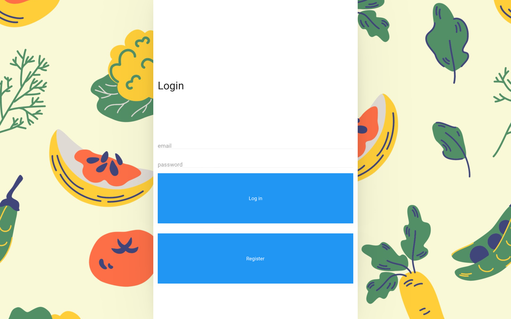
Figure 9. The login screen

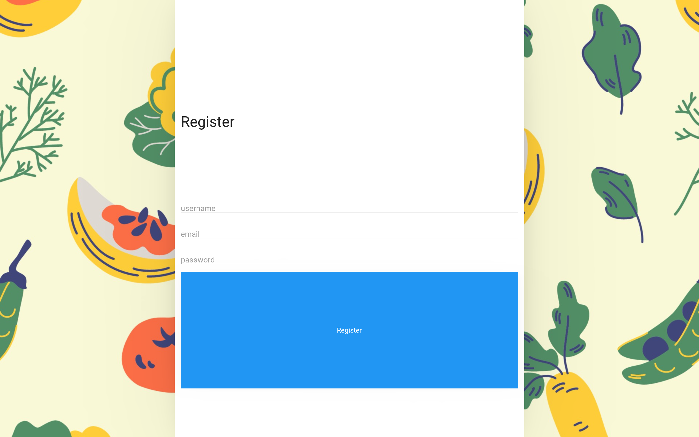
Figure 10. The register screen 

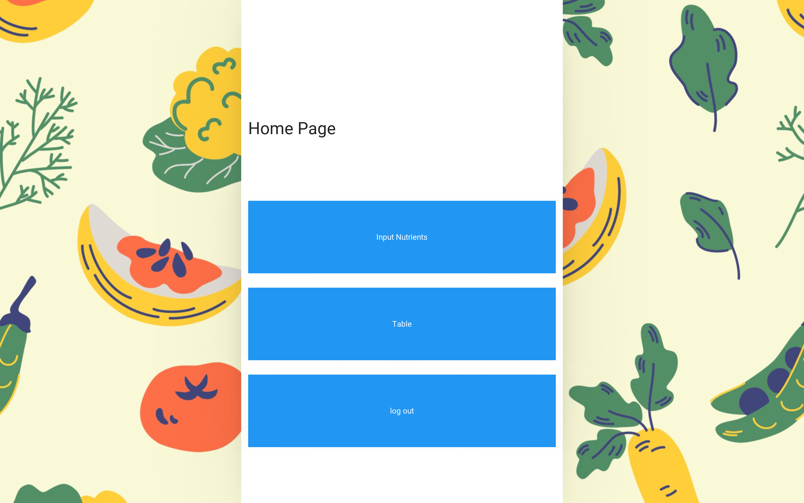
Figure 11. The home page


Figure 12. The input screen

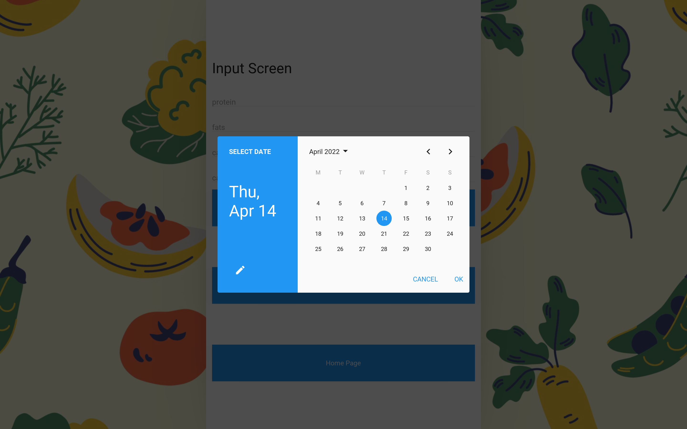
Figure 13. The calendar to input dates

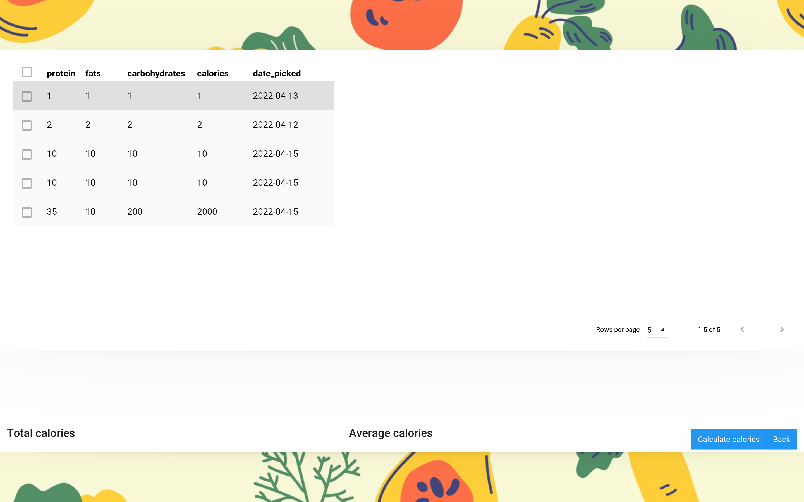
Figure 14. The table screen

### Future Updates

As the application is for everyday use, automatic updates would be the optimal type. If users were to manually update each time, it would be tedious. Additioanlly, manual updates would hinder the users' abilities to log their daily nutrients without updating first; which would be go against the overall functionality of the application. This is because the application's purpose is to log daily intakes of nutrients. The inability to do so is against the app's purpose. Updates should occur 1-2 times a month as, according to appify.digital, incremental improvements are better than sopradic overhauls of the app. This is because, if small incrementtal improvements are made and users are critical of them, it is easy to act upon the suggestions. 

## Criteria D: Functionality

https://www.youtube.com/watch?v=x0dyokWELlg

## Citations
1. Wali, K., Ramnani, M., Krishna, S., &amp; Chatterjee, P. (2021, May 29). 8 python GUI frameworks for developers. Analytics India Magazine. Retrieved February 24, 2022,
2. Advantages and disadvantages of python - how it is dominating Programming World. DataFlair. (2021, August 25). Retrieved April 26, 2022
3. Theo DespoudisTheo Despoudis is a Senior Software Engineer and an experienced mentor. He has a keen interest in Open Source Architectures. (2021, March 23). The best python frameworks for mobile development and how to use them. ActiveState. Retrieved April 26, 2022
4. What is KivyMD: Creating android machine learning apps using KivyMD. Analytics Vidhya. (2021, July 6). Retrieved February 24, 2022,
5. Theo DespoudisTheo Despoudis is a Senior Software Engineer and an experienced mentor. He has a keen interest in Open Source Architectures. (2021, March 23). The best python frameworks for mobile development and how to use them. ActiveState. Retrieved April 26, 2022 
6. What is Kivy? GeeksforGeeks. (2020, January 30). Retrieved April 26, 2022
7. Yegulalp, S. (2019, February 13). Why you should use sqlite. InfoWorld. Retrieved April 26, 2022
8. What is sqlite? top sqlite features you should know. SQLite Tutorial. (2020, July 8). Retrieved March 9, 2022
9. Sqlite vs. MySQL vs. PostgreSQL: A comparison of relational databases. Logz.io. (2021, November 1). Retrieved April 26, 2022, 
10. Why learn python? 6 reasons why it's so hot right now. CodingNomads. (2022, January 19). Retrieved February 24, 2022, 
11. Appify. (2022, February 3). How often should you update your app? Appify. Retrieved April 18, 2022, 
12. John Elder John is the CEO of Codemy.com where he teaches over 100, Elder, J., *, N., posts, J. E. V. all, &amp; posts, V. all. (1969, March 1). KIVYMD date Picker – Python Kivy Gui tutorial #51. KivyCoder.com. Retrieved April 18, 2022,
