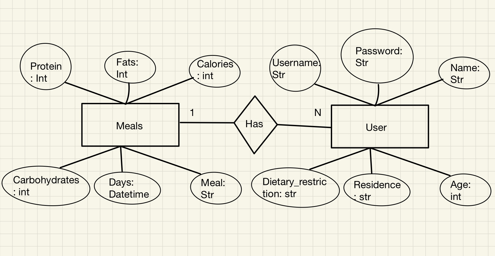

# Unit 3 Project: PFC (Protein, Fat, and Calories) Application Documentation

## Criteria A: Planning

### Problem Definition:
 
The client for this project is Kojiro Matsumoto. He is interested in keeping account of his nutrients intake per meal. Specifically, the intake of protein, fat, carbohydrates, and calories. Due to this, he would like an application that would allow him to keep track of his protein, fat, and calories intake per day.

### Success Criteria:

1. The application should have a log in system.
2. The application should have a sign up system.
3. The passwords of users should be encoded in a secure manner.
4. After the user logs in, the user should be able to pick whether they want to log their PFC intake (protein, fat, carbohydrates and calories) or monitor their PFC intakes.
5. To monitor PFC intakes, a calendar will be displayed. When users click on a date, the PFC intakes will be displayed.
6. The application should include cartoon drawings of food for asthetic purposes.

### Design Statement

I will design and make an application for a client who is interested in keeping track of his protein, fat, carbohydrates and calories intakes per day. The application will allow the client to log in, log their PFC (protein, fat, carbohydrates, and calories) intakes, and monitor their PFC intakes per day. Additionally, the log in system will ensure passwords to be encoded and secure. The application will be constructed using Pycharm, the Python language, and the KivyMD Language. This project will take 4 weeks and will be evaluated according to the criteria set above.

### Rationale for Proposed Solution

For the application, we will be using the Python language, as according to CodingNomads, is the most used language used coding language in the world and the langauge I am most comfortable with. If I were to use another language, I would have to learn the new language, slowing the process of creating the application. Additionally, Python ios compatible with the library that is being used (KivyMD). Therefore, using Python is most appropriate for this project compared to alternatives such as JavaScript or C. The library I will be using is KivyMD. KivyMD is a library that can be used with Python. According to Analytics Vidhya, KivyMD is extremely easy to use. Therefore, learning the functions of it will not take long. Furthermore, it facilitates cross-platform applications that can run on Windows, Linux, Android, OSX, IOS, and Rasberry Pi as well. Due to its versatilities, I will be using KivyMD instead of alternatives such as Libavg or PyQT. The database I will be using is SQLite. According to SQLitetutorial, SQLite allows  a single database connection to access multiple database files simultaneously. Furthermore, is capable of creating in-memory databases that are fast to work with (SQLite tutorial). Due to this, I have chosen KivyMD rather than alternatives such as Oracle Database, MariaDB, or IMB db2.

### Details

When first opening the application, a log in or sign up option will be displayed. There will be cartoon drawings of nutritious foods as decorations. Once signed up, an option to log the PFC intakes or monitor the PFC will be displayed. If you were to log the PFC intakes, there will be three white boxes where you input the protein, fat, carbohydrates, and calories intakes. If you were to monitor the PFC intakes, a calendar with dates will appear. Once clicking on a date, the PFC intakes of that particular date will be displayed. 

### Citations

1. Wali, K., Ramnani, M., Krishna, S., &amp; Chatterjee, P. (2021, May 29). 8 python GUI frameworks for developers. Analytics India Magazine. Retrieved February 24, 2022,
2. What is KivyMD: Creating android machine learning apps using KivyMD. Analytics Vidhya. (2021, July 6). Retrieved February 24, 2022,
3. What is sqlite? top sqlite features you should know. SQLite Tutorial. (2020, July 8). Retrieved March 9, 2022
4. Why learn python? 6 reasons why it's so hot right now. CodingNomads. (2022, January 19). Retrieved February 24, 2022, 

## Criteria B: Solution Overview

### System Diagram

### ER

### Table of Data

